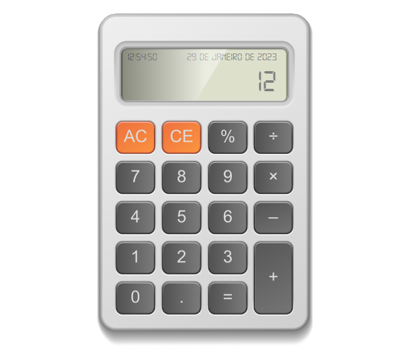

# JavaScript Calculator

project carried out in the **_javascript course - Complete course with 6 real [HCODE](https://www.hcode.com.br/) projects_**, in this project I was able to put into practice the following concepts:

- MVC
- Object Orientation
- Constructor and encapsulation
- Manipulate the DOM
- Work with date and time
- QuerySelector
- Click event
- Event using split()
- switch
- Operations - inNaN and Array.length
- Work with audio
- Error Handling

#### Project

#### Used Technologies

 html
 css
 javascript
